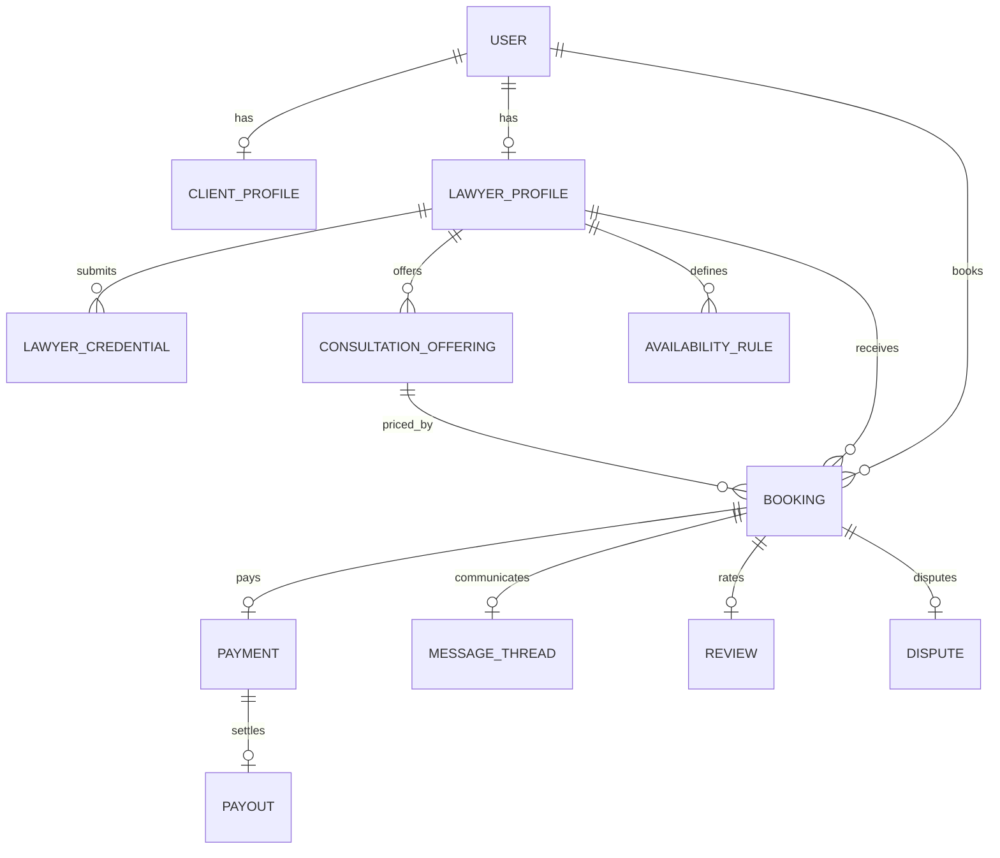

# 5. Database Design

| Field | Value |
|-------|-------|
| Document | Database Design |
| Status | Draft for approval |
| Source of truth | `prisma/schema.prisma` (already migrated) |
| Engine | PostgreSQL · Prisma 7 |

---

## 5.1 Design principles

- Single database for MVP modular monolith  
- Auth.js-compatible identity tables  
- Soft deletes via `deletedAt` where user-facing entities need recovery/audit  
- Money as **integer MNT** (no floats)  
- Append-only `booking_status_histories` and `audit_logs`  
- Additive migrations only going forward  

---

## 5.2 Enum catalog

| Enum | Values |
|------|--------|
| `UserRole` | CLIENT, LAWYER, ADMIN |
| `UserStatus` | ACTIVE, SUSPENDED, DEACTIVATED |
| `LawyerVerificationStatus` | PENDING, APPROVED, REJECTED, SUSPENDED |
| `CredentialReviewStatus` | SUBMITTED, APPROVED, REJECTED |
| `BookingStatus` | DRAFT, PENDING_PAYMENT, PENDING_ACCEPTANCE, CONFIRMED, IN_PROGRESS, COMPLETED, CANCELLED, REFUNDED, DISPUTED |
| `PaymentStatus` | PENDING, SUCCEEDED, FAILED, REFUNDED, PARTIALLY_REFUNDED |
| `PayoutStatus` | PENDING, PROCESSING, PAID, FAILED |
| `RefundStatus` | REQUESTED, APPROVED, REJECTED, PROCESSED |
| `DisputeStatus` | OPEN, RESOLVED_CLIENT, RESOLVED_LAWYER, CLOSED |
| `NotificationType` | ACCOUNT_VERIFIED, LAWYER_APPROVED, LAWYER_REJECTED, BOOKING_*, PAYMENT_*, MESSAGE_RECEIVED, CONSULTATION_REMINDER, REVIEW_REQUESTED, PAYOUT_PROCESSED |
| `AuditAction` | CREATE, UPDATE, DELETE, LOGIN, LOGOUT, APPROVE, REJECT, SUSPEND, REFUND |
| `DayOfWeek` | MONDAY…SUNDAY |
| `TermsType` | TERMS_OF_SERVICE, PRIVACY_POLICY, MARKETPLACE_DISCLAIMER |
| `LanguageProficiency` | BASIC, CONVERSATIONAL, FLUENT, NATIVE |

---

## 5.3 Entity groups

### Identity & auth

| Table | Purpose |
|-------|---------|
| `users` | Core identity + role/status |
| `accounts` | OAuth/provider accounts (Auth.js) |
| `sessions` | DB sessions (adapter) |
| `verification_tokens` | Email verify / reset tokens |
| `terms_acceptances` | Versioned ToS/Privacy acceptance |

### Profiles & credentials

| Table | Purpose |
|-------|---------|
| `client_profiles` | Client extras (phone, company) |
| `lawyer_profiles` | Public lawyer identity, listing, ratings denorm |
| `lawyer_credentials` | License docs + review workflow |

### Taxonomy

| Table | Purpose |
|-------|---------|
| `practice_areas` | MN/EN labeled areas |
| `languages` | MN/EN languages |
| `lawyer_practice_areas` | M:N |
| `lawyer_languages` | M:N + proficiency |

### Catalog

| Table | Purpose |
|-------|---------|
| `consultation_offerings` | Priced products |
| `availability_rules` | Weekly windows |
| `availability_exceptions` | Dated overrides |

### Bookings & money

| Table | Purpose |
|-------|---------|
| `bookings` | Consultation reservations |
| `booking_status_histories` | Transition audit |
| `payments` | Client charge + fee split |
| `payouts` | Lawyer net payout tracking |
| `refunds` | Refund workflow |
| `disputes` | Manual dispute cases (1:1 booking) |

### Communication & trust

| Table | Purpose |
|-------|---------|
| `message_threads` | 1:1 with booking |
| `messages` | Chat messages |
| `message_attachments` | File metadata |
| `reviews` | Ratings |
| `notifications` | In-app inbox |
| `audit_logs` | Platform audit |
| `platform_settings` | Operational knobs |

**Model count:** 28 (matches Sprint 1 marketplace schema).

**Lawyer photo:** use `users.image_url` (no separate lawyer photo column required for MVP).

---

## 5.4a Planned additive columns (before / during S6 — approved by Architecture Review)

These are **not** in the current migrated schema yet. They must be added via additive migration before booking concurrency and FR-COMM delivery instructions go live:

| Table | Column | Type | Purpose |
|-------|--------|------|---------|
| `bookings` | `meeting_url` | `String?` | External call link (Zoom/Meet/phone note URL) |
| `bookings` | `meeting_instructions` | `Text?` | Join instructions for client/lawyer |
| `bookings` | `version` | `Int @default(1)` | Optimistic concurrency for conflict-safe updates |

No other MVP feature requires a schema rewrite.

## 5.4 Key relationships

```text
User 1──1 ClientProfile
User 1──1 LawyerProfile
LawyerProfile 1──N LawyerCredential
LawyerProfile M──N PracticeArea
LawyerProfile M──N Language
LawyerProfile 1──N ConsultationOffering
LawyerProfile 1──N AvailabilityRule / AvailabilityException
Booking N──1 User (client)
Booking N──1 LawyerProfile
Booking N──1 ConsultationOffering
Booking 1──1 Payment
Payment 1──1 Payout
Booking 1──1 MessageThread
Booking 1──1 Review
Booking 1──1 Dispute
Payment 1──N Refund
```

---

## 5.5 Critical indexes (already present)

- `users (role, status)`, soft-delete  
- `lawyer_profiles (is_listed, verification_status)`, rating sort  
- `bookings (lawyer, status)`, `(lawyer, scheduled_start, scheduled_end)` for conflict scans  
- `payments.provider_payment_id` unique (webhook idempotency)  
- `reviews (lawyer, is_visible, created_at)`  

---

## 5.6 Seed data (current)

| Seed | Content |
|------|---------|
| Practice areas | Family, Criminal, Contract/commercial, Labor, Property, Immigration, Business registration, Other |
| Languages | `mn`, `en` |
| Platform settings | `platform_fee_percent=15`, cancellation/SLA hours, terms/privacy versions |

**Not seeded yet:** demo users, admin operator (add when implementation starts).

---

## 5.7 Data migration notes for upcoming sprints

| Change | Approach |
|--------|----------|
| Profile backfill for S1 users | One-time script: create missing Client/Lawyer profiles |
| Booking meeting fields + version | Additive migration (see §5.4a) before S6 |
| New columns | Additive Prisma migrations only |
| Enum additions | Prisma migrate with expand strategy; avoid renames mid-MVP |
| Destructive drops | Forbidden without explicit Product approval |

---

## 5.8 ER diagram (logical)



---

## 5.9 Future schema caution (AI / Workspace)

Do **not** add AI conversation tables or Matter/Document tables into the marketplace MVP schema without a separate approved RFC. Shared users may link later via `user_id` foreign keys from new contexts.
