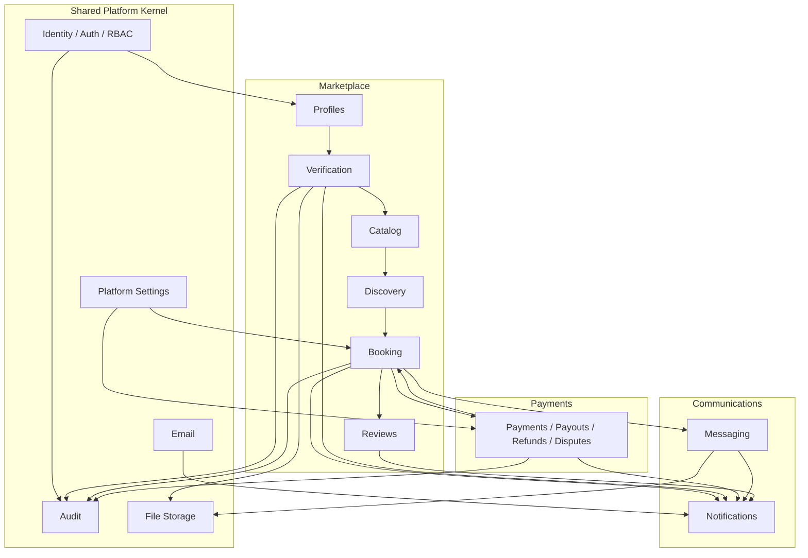

# 9. Dependency Graph

| Field | Value |
|-------|-------|
| Document | Dependency Graph |
| Status | Draft for approval |

---

## 9.1 Bounded-context dependencies



---

## 9.2 Hard build order

```text
Identity (S1)
  └─ Profiles (S2)
       └─ Verification (S3)
            └─ Catalog (S4)
                 └─ Discovery (S5)
                      └─ Booking (S6)
                           ├─ Payments (S7)
                           ├─ Messaging (S8)
                           └─ Reviews (S9)
                                └─ Notifications hardened (S9)
                                     └─ Admin / Launch (S10)
```

**Soft parallelization**

- Email port can start in S2 and harden through S9.  
- Payment provider evaluation runs **in parallel** S2–S5; integration only in S7.  
- Notification **persistence** may begin as soon as events exist (even if email is console).  
- i18n catalog introduction recommended by S5 before public pages harden.

---

## 9.3 Domain service consumers

| Service | Upstream consumers |
|---------|-------------------|
| `rbac` | Middleware, shells |
| `lawyer-eligibility` | Verification, Discovery, Booking, Catalog listing |
| `slug-generator` | Profiles |
| `booking-state-machine` | Booking, Payments (status coupling), Admin |
| `slot-availability` | Catalog writes, Booking create |
| `booking-number` | Booking create |
| `fee-calculator` | Payments |
| `cancellation-policy` | Cancel / Refund |
| `rating-aggregator` | Reviews |

---

## 9.4 Infrastructure dependency graph

```text
Prisma Client
  └── Prisma*Repository adapters

Auth.js
  └── Identity only

FileStorage ──► Verification, Messaging
Email        ──► Identity, Notifications
PaymentGW    ──► Payments + webhook
Cron/Jobs    ──► Reminders, auto-complete
```

---

## 9.5 Data dependencies on register path (S2 fix)

```text
User create
  ├─ TermsAcceptance bundle
  ├─ AuditLog CREATE
  └─ ClientProfile OR LawyerProfile (+ slug for lawyer)
```

Today’s gap: profile branch missing → must be first S2 dependency unlock.

---

## 9.6 Event fan-out (logical)

| Event | Typical subscribers |
|-------|---------------------|
| UserRegistered | Notification, Audit |
| LawyerApproved / Rejected | Notification, Listing rules |
| BookingCreated | Notification (lawyer) |
| PaymentSucceeded | Booking progression, Notification |
| BookingConfirmed | Messaging thread create, Notification |
| BookingCompleted | Review request, Notification |
| MessageSent | Notification (recipient) |
| ReviewSubmitted | Rating denorm, Notification |

---

## 9.7 Circular dependency policy

- Payments may update Booking status; Booking must not call PaymentGateway from domain — **orchestrate in application use-cases** (e.g. `confirmPaymentForBooking`).  
- Diagram edge `PAY → BOOK` means *application payment flow mutates booking status*, not a domain-layer import cycle.  
- Notifications never call back into booking/payment domain; they are sink-only.  
- Dispute state lives on Booking; refund money lives on Payment — Admin use-cases may call both without merging aggregates.
